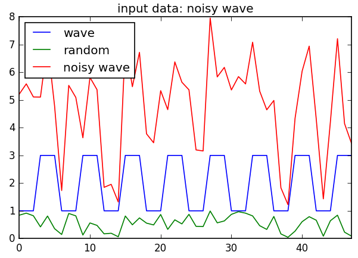
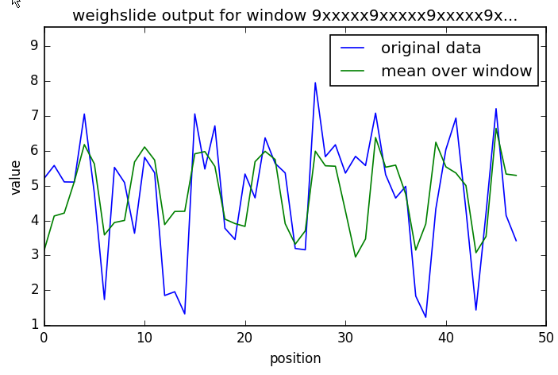

# Weighslide

Weighslide is a python program to calculate sliding windows across of a list of numerical values.
The user sets the window size, and the exact weighting of each value in the window.

The sliding window (rolling window) analysis is used in diverse scientific and financial fields.
The current weighslide program is designed to be easy to use and allows highly customisable windows. Weighslide is not currently
optimised for large datasets.

**Citation:**<br /> A publication will be added at a later date. For now, please cite as follows:
"A sliding window analysis was performed using the weighslide module in python (Mark Teese, Technical University of Munich)."

# How it works
Weighslide takes as an input a 1D array (list) of numerical data, and applies a user-defined weighting and
    algorithm in a sliding-window fashion across the data.
    

    For example:
    window = [ 2  5  2 ]
    statistic = "mean"
    dataset = [ 0  0  0  1  1  2  3  5  8  13  21]
    The window length is 3. The array will therefore be sliced as follows:
              [ NaN  0  0 ]
                 [ 0  0  1 ]
                    [ 0  1  1 ]
                      [ 1  1  2 ] and so on until the final slice [ 13  21  NaN ]
    Each array slice will be "weighted" by multiplication with the window, array-style, resulting in:
              [ NaN  0  0 ]
                 [ 0  0  2 ]
                    [ 0  5  2 ]
                       [ 2  5  4 ] and so on.
    If the "statistic" variable is given as "mean", a mean will be calculated for each array slice.
              [    0    ]
                 [   0.66  ]
                    [   2.33  ]
                       [  3.66  ] and so on.
    The "statistic" can be mean, std, or sum.
    The value (in this case the mean) will replace the central position in the output 1D array.
    output = [ 0.00  0.00  0.66  2.33  3.66  6.00  9.66  15.6  25.3  41.0  65.5  ]

The first and last array slices always contain flanking "not a number" (Nan) values, which are ignored in all calculations.
The first and last output values therefore do not represent results from true, full-length windows.

# Installation
Weighslide depends on the following:
* python (tested for version 3.5)
* numpy
* pandas
* matplotlib

For Windows users, we recommend Anaconda python 3.x. The Anaconda package should contain all required python modules.

To install as a python module, allowing `import weighslide`, open the command console and navigate to the weighslide folder
containing setup.py. Run the following:

`python setup.py install`

# Test
To test the module, open the command console and navigate to the folder
containing weighslide.py. Run the following:

`python weighslide.py [1,1,"x",1,1] mean -r [1,1,2,3,5,8,13,21,34]`

If successful, an output list will be printed on the screen.

# Usage
Here is an example of how to run weighslide within python, using an excel input file.
```
import weighslide
infile = r"D:\Path\To\Your\File\infile_name.xlsx"
# for excel files, you will need to input the sheet name containing the data
excel_kwargs = {"sheet_name":"Sheet1"}
# if it's an excel file with multiple columns, define which column contains the data
column = "your data column header"
# define the window and statistic. The following parameters are used
# if you want to calculate mean of the four surrounding values in the sequence
window = [1,1,"x",1,1]
statistic = "mean"
name = "your short sample name"
weighslide.run_weighslide(infile, window, statistic, name=name, column=column, excel_kwargs=excel_kwargs)
```

Here is an example of how to run weighslide from the command line, using a csv input file.
```
python weighslide.py [1,1,'x',1,1] mean -i "D:\Path\To\Your\File\infile_name.xlsx" -c "your data column header"
```
In both cases the output files will be created in a subfolder within the same location as the input file.

For more help regarding the command-line options:
`python weighslide.py -h`

Here is an example designed for jupyter notebook, showing the power of weighslide
to smoothen a repeated element in a noisy dataset.
```
# create a noisy wave that repeats every 6th position. Save to csv.
import weighslide
import numpy as np
import pandas as pd
import matplotlib.pyplot as plt
% matplotlib inline
plt.rcParams["savefig.dpi"] = 120
df = pd.DataFrame()
df['wave'] = [1,1,1,3,3,3]*8
df["random"] = np.random.random_sample(df.shape[0])
df["noisy wave"] = df.wave + df.random*5
df.plot(title="input data: noisy wave")
df.to_csv("wave.csv")
```

```
# run weighslide with a window that averages every 6th position
window = "9xxxxx9xxxxx9xxxxx9xxxxx9xxxxx9xxxxx9"
weighslide.run_weighslide("wave.csv", window, "mean", name="wavetest", column="noisy wave", overwrite=True)
```



**Examples of windows:**<br/>
[1,1,1]<br/>&#8195; - if "statistic" is set to "mean", this window returns the average of the central position, and the two neighbouring positions
&#8195; - the window size is 3<br>


[1,1,"x",1,1]<br/>&#8195; - the central position "x" has no weighting at all
&#8195; - the window size is 5, it consists of the central position, two upstream, and two downstream positions
&#8195; - the positions upstream (-1, -2) and downstream (1, 2) of the central position are all equally weighted
&#8195; - if the statistic is set to "mean", the result for each position will simply be the average of the surrounding 4 positions<br>

[0.5, 1, 0.5, 2, 0.5, 1, 0.5]<br/>&#8195; - the central position "2" is highly weighted (2*orig value)
&#8195; - the window size is 7, it consists of the central position, three upstream, and three downstream positions
&#8195; - the positions upstream (-1, -2, -3) and downstream (1, 2, 3) of the central position are unequally weighted.
&#8195; - if the statistic is set to "mean", the result for each position will simply be the average of the surrounding 4 positions<br>

# Contribute
If you encounter a bug or weighslide doesn't work for any reason, please send me an email (available at my TUM website) or initiate an issue in Github.
Pull requests are welcome.

# License
Weighslide is free software distributed under the GNU General Public License version 3.
